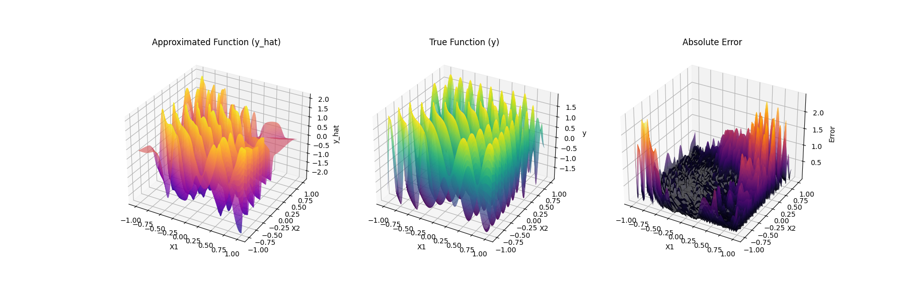
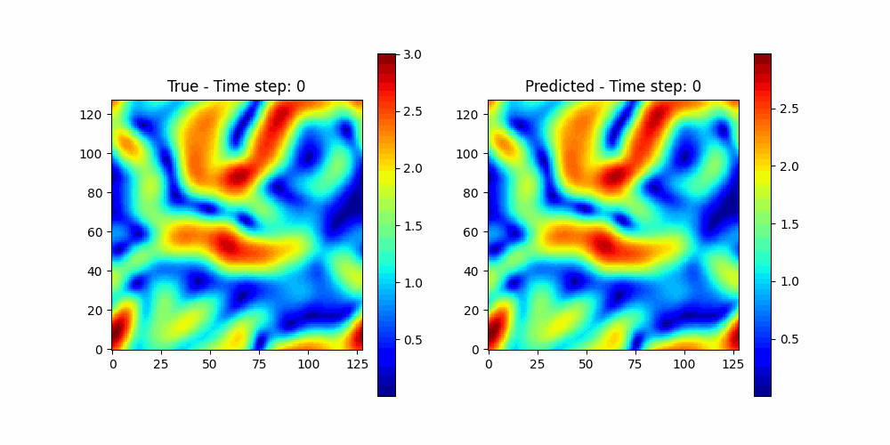

# Project Overview

This repository contains implementations and experiments focused on function interpolation and Partial Differential Equation (PDE) solvers using advanced techniques like PINNs, Fourier embeddings, and novel architectures such as PIRATE and KAN. Implementation is done in Jax for its computational efficiency. Key highlights include:

### Interpolation:
- Evaluation of PIRATE, KAN, and MLP architectures with and without Fourier features to examine spectral bias towards low-frequency functions.
- Experiments comparing parameter efficiency, with KANs tested for their claimed advantage in this area.

*Figure 1: Neural networks struggle to learn high frequency components.*

*Figure 2: Fourier Features ease the spectral bias allowing the learning of high frequency components.*

### PINNs:
- Solutions for Helmholtz, Heat, and Burgers equations.
- Configurations are customizable through `.yaml` files for flexible testing of different setups.
- Navier–Stokes flow in a torus

*Figure 2: PINN solution to Navier–Stokes flow in a torus.*

## Table of Contents

1. [Project Overview](#project-overview)
2. [Repository Structure](#repository-structure)
    - [Root Directory](#root-directory)
    - [Subdirectories](#subdirectories)
      - [`pikan/`](#pikan)
      - [`results/`](#results)
      - [`old/`](#old)
      - [`yaml_configs/`](#yaml_configs)
3. [Usage Instructions](#usage-instructions)

---

## Repository Structure

### **Root Directory**
- **`.ipynb` Files**: Jupyter notebooks for various experiments and demonstrations:
  - **`Interpolation.ipynb`**: Main notebook for interpolation experiments.
  - **`PINNS.ipynb`**: Demonstrates the use of Physics-Informed Neural Networks.
  - **`csvs_display.ipynb`**: Utilities for displaying results stored in CSV files.

---

### **Subdirectories**

#### 1. **`pikan/`**
The Python package implementing all the core logic. Most functions are located here.

- **Key Files:**
  - `interpolated_funcs.py`: List of sample functions to interpolate.
  - `model_utils.py`: Functions for managing and training models.
  - `pde_utils.py`: Functions related to PINNs.
  - `utils.py`: General utility functions.

#### 2. **`results/`**
Organizes output data from experiments, including trained models, CSVs, and visualizations.
- **Subfolders:**
  - **`csvs/`**: Performance results stored as CSVs for different parameter settings and methods.
  - **`models/`**: Trained models categorized by experiment type.
  - **`visuals/`**: Plots and other visual representations of results.

#### 3. **`old/`**
Contains archived experiments with unorganized code and unfinished implementations.

#### 4. **`yaml_configs/`**
Stores YAML configuration files for various experiments and PDE setups.
- **Key Folders:**
  - **`PDE_configs/`**: Configuration files specific to PDE experiments.
- **Key Files:**
  - `increase_freq_*.yaml`: Configurations for experiments with varying frequencies.
  - `SWEEP_*.yaml`: Sweeping configurations for broader experiments.
